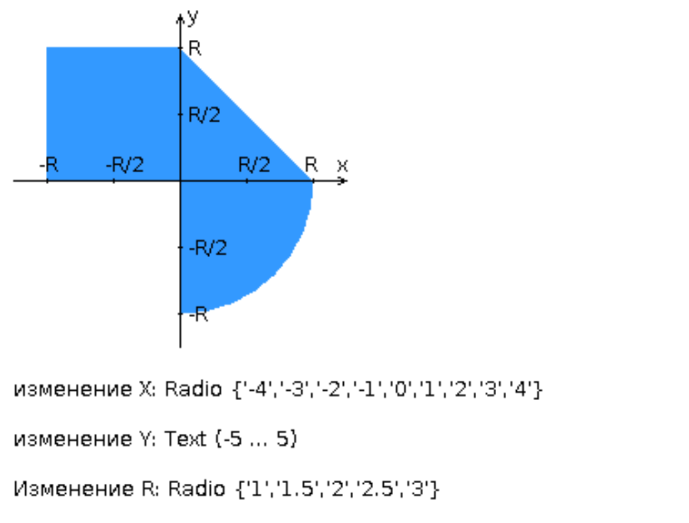

# Лабораторная работа №1 по Веб-программированию

### Общая информация

*   **Вариант:** 466730 (номер ИСУ)
*   **Автор:** Михайлов Петр Сергеевич (группа P3211)
*   **Лектор:** Егошин Алексей Васильевич
*   **Принимающий:** Лазеев Сергей Максимович

---

## Описание проекта

Данный проект представляет собой реализацию интерактивного веб-приложения в соответствии с заданием лабораторной работы. Приложение состоит из двух основных частей:

1.  **Клиентская часть (Frontend):** Полноценное одностраничное приложение (SPA). HTML-страница со стилями на CSS и логикой на JavaScript. Пользователь может вводить координаты точки (X, Y) и радиус (R). Вся логика хранения и отображения истории проверок **полностью перенесена на клиент** (требование принимающего) с использованием `localStorage`
2.  **Серверная часть (Backend):** FastCGI-сервер, написанный на Java. Его единственная задача — принять координаты одной точки, провести валидацию и вычисления, после чего вернуть результат только для этой точки. Сервер не хранит сессии или историю.

## Задание на лабораторную работу

Разработать FastCGI сервер на языке Java, определяющий попадание точки на координатной плоскости в заданную область, и создать HTML-страницу, которая формирует данные для отправки их на обработку этому серверу.

Параметр R и координаты точки должны передаваться серверу посредством HTTP-запроса. Сервер должен выполнять валидацию данных и возвращать HTML-страницу с таблицей, содержащей полученные параметры и результат вычислений - факт попадания или непопадания точки в область (допускается в ответе сервера возвращать json строку, вместо html-страницы). Предыдущие результаты должны сохраняться между запросами и отображаться в таблице.

Кроме того, ответ должен содержать данные о текущем времени и времени работы скрипта.

**Комментарии по выполнению ЛР:**
*   Требуется поднять Apache httpd веб-сервер от лица своего пользователя на гелиосе.
*   Веб-сервер должен заниматься обслуживанием статического контента (html, css, js) и перенаправлять запросы за динамическим контентом к FastCGI серверу.
*   FastCGI сервер требуется реализовать на языке Java и поднять также на гелиосе.
*   **Путем обращений из JavaScript к FastCGI серверу требуется показать понимание принципа AJAX.**

**Разработанная HTML-страница должна удовлетворять следующим требованиям:**
*   Для расположения текстовых и графических элементов необходимо использовать **табличную верстку**.
*   Данные формы должны передаваться на обработку посредством **GET-запроса**.
*   Таблицы стилей должны располагаться в отдельных файлах.
*   При работе с CSS должно быть продемонстрировано использование селекторов дочерних элементов, селекторов потомств, селекторов атрибутов, селекторов классов а также такие свойства стилей CSS, как наследование и каскадирование.
*   HTML-страница должна иметь "шапку", содержащую ФИО студента, номер группы и номер варианта. При оформлении шапки необходимо явным образом задать шрифт (**serif**), его цвет и размер в каскадной таблице стилей.
*   Отступы элементов ввода должны задаваться в процентах.
*   Страница должна содержать сценарий на языке JavaScript, осуществляющий валидацию значений, вводимых пользователем в поля формы. Любые некорректные значения (например, буквы в координатах точки или отрицательный радиус) должны блокироваться.

## График области



Область состоит из:
*   **I четверть:** Прямоугольный треугольник с вершинами в (0, 0), (R, 0) и (0, R).
*   **II четверть:** Прямоугольник с вершинами в (0, 0), (-R, 0), (-R, R) и (0, R).
*   **III четверть:** Пустая область.
*   **IV четверть:** Четверть круга радиуса R с центром в (0, 0).

## Структура проекта

```
.
├── docs/
│   ├── images/
│      └── graph.png                         # Изображение с графиком области
│   └── reports/
│      ├── Михайлов Петр P3211 Веб-программирование Лабораторная работа 1.docx     # Отчет по лабораторной работе в формате .docx
│      └── Михайлов Петр P3211 Веб-программирование Лабораторная работа 1.pdf      # Отчет по лабораторной работе в формате .pdf
├── httpd-root/                               # Папка для развертывания на сервере - helios'е (DocumentRoot)
│   ├── conf/
│      └── httpd.conf                         # Конфигурация для Apache
│   ├── fastcgi-sockets/                      # Сугубо для корректной работы Apache
│      └── dynamic/                           # Сугубо для корректной работы Apache
│   ├── fcgi-bin/
│      ├── java.fcgi                          # Сугубо для корректной работы Apache
│      ├── labwork1.jar                       # JAR-ник - весь backend лежит здесь
│      └── run-java.sh                        # Скрипт для запуска jar-ника
│   ├── mutex-dir/                            # Сугубо для корректной работы Apache
│   ├── static/                               # Frontend для запуска на helios
│      ├── styles/                            # Логика проверки попадания точки
│      ├── main.css                           # Основные стили
│      └── reset.css                          # Сброс стилей браузера
│         ├── index.html                      # Основной скрипт клиентской логики
│         └── index.js                        # Логика проверки попадания точки
│   ├── access.log                            # Логи доступа от Apache
│   ├── error.log                             # Логи ошибок от Apache
│   ├── java-fcgi.log                         # Сугубо для корректной работы Apache
│   └── java-fcgi.pid                         # Сугубо для корректной работы Apache
├── libs/
│   └── fastcgi-lib.jar                       # Скачанная с se.ifmo.ru библиотека для fastcgi
├── src/                                      # Исходный код Java-сервера
│   └── main/
│       ├── java/
│           └── ru/pmih/web/
│               ├── AreaCalculator.java       # Логика проверки попадания точки
│               ├── CgiHandler.java           # Основной обработчик запросов (stateless)
│               ├── CgiUtils.java             # Набор низкоуровневых утилит для работы с CGI/FastCGI окружением
│               ├── ErrorResponse.java        # DTO для стандартизированных ответов об ошибках
│               ├── HistoryEntry.java         # DTO для результата одной проверки
│               ├── HistoryManager.java       # Хранение и управление историей запросов
│               ├── InstantAdapter.java       # Адаптер Gson для корректной сериализации времени
│               ├── LocalServer.java          # Встроенный сервер Javalin для локальной разработки
│               ├── Main.java                 # Точка входа, инициализация FastCGI
│               ├── Params.java               # Парсинг и валидация параметров запроса
│               └── ValidationException.java  # Пользовательское исключение для ошибок валидации
│       └── resources/                        # Frontend для LocalServer.java (Javalin)
│           └── static/
│               ├── styles/                   # Логика проверки попадания точки
│                   ├── main.css              # Основные стили
│                   └── reset.css             # Сброс стилей браузера
│               ├── index.html                # Основной скрипт клиентской логики
│               └── index.js                  # Логика проверки попадания точки
├── build.gradle                              # Настройки для gradle
├── guide.txt                                 # Команды для запуска
└── README.md                                 # Этот файл
```
